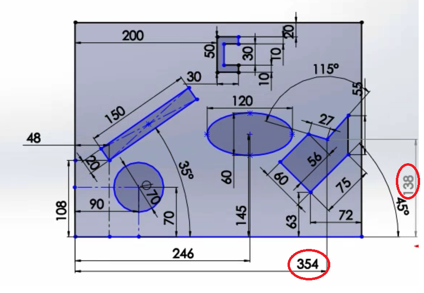
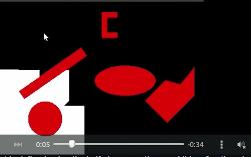
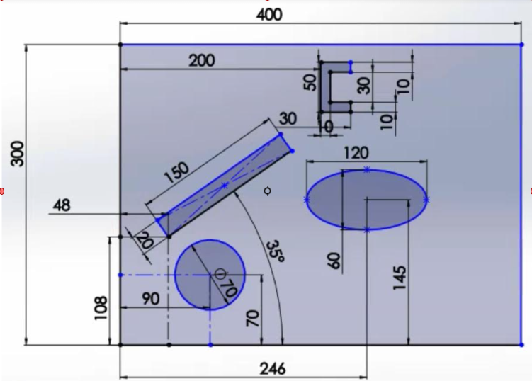
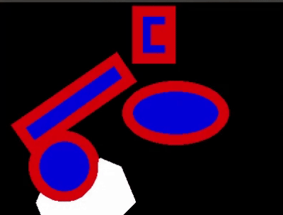
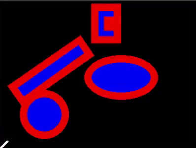
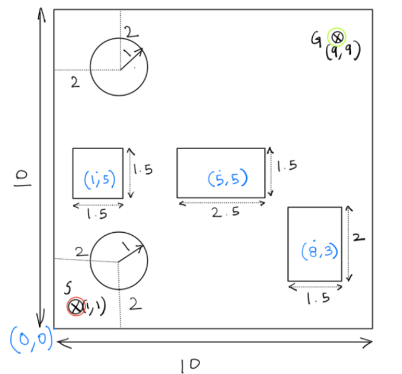
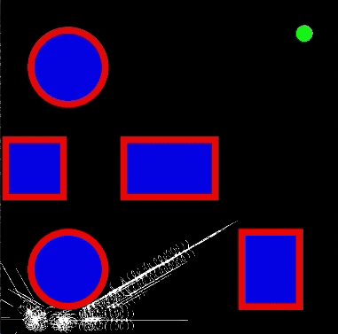
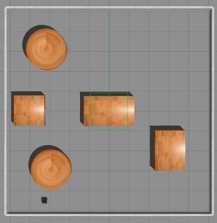

# Graph-based-Planning-Algorithms
This repository contains the implementations of classical graph based planning algorithms.

---
## Breadth First Search Algorithm
This project implements the generalized solver for a point robot using the Breadth
First Search algorithm. It has a Node class having the attributes and methods useful
for executing the BFS algorithm. Also, it keeps track of the parent node for
backtracking after finding the goal state for the maze. It uses the deque class from
collections module as the data structure to optimize the enqueue and dequeue
operations. NOTE: The obstacle space for the robot is defined using the half
plane equations and it has 8 actions i.e up, down, left, right, upleft, upright,
downleft and downright. For the implementation video checkout [this link](https://drive.google.com/file/d/1KIGiUc6lRY8RuYK_3aIm1XiIpMVz_Fxm/view?usp=sharing).

### Map Dimensions
 
 
### Pygame Simulation 



## Dijkstra's Algorithm
This project implements the generalized solver for a point robot using Dijkstra's
algorithm. It has a Node class having the attributes and methods useful for executing
Dijkstra's algorithm. Also, it keeps track of the parent node for backtracking after
finding the goal state for the maze. For the implementation video checkout [this link](https://drive.google.com/file/d/1rKrIdbSIvRrdPHk6g9vpPVPmPgG8I2FC/view?usp=sharing).

### Map Dimensions

 
### Pygame Simulation 



## Astar Algorithm 
This project implements the generalized solver for a point robot using Astar  
algorithm. It has a Node class having the attributes and methods useful for executing
the algorithm. Also, it keeps track of the parent node for backtracking after
finding the goal state for the maze. For the implementation video checkout [this link](https://drive.google.com/file/d/1Y1BaySj0dLIgrCS5CBwUw2dQXM_F6MRK/view?usp=sharing).

 
### Pygame Simulation 


---
## Astar with Differential constraints and simulation in ROS Gazebo
This is an extension of the previous Astar implementation with simulation in ROS gazebo environment. For the implementation video checkout [this link](https://drive.google.com/file/d/1Raet7Rv4Xu6kGkfY20fyEApm3RU-xcgq/view?usp=sharing).

### Map Dimensions


### Pygame Simulation 


### Gazebo Simulation 


---
### Dependencies
1) rospy
2) rospkg
3) tf
4) geometry_msgs
5) sensor_msgs

---
### How to run the code 
1) The package for running the simulation is named *velocity_publisher*.
2) Please run the below command to launch the turtlebot3 in the gazebo
environment:

```roslaunch velocity_publisher velocity_publisher.launch```

3) After launching the above file, please run the below command to make the
robot go to the goal position:

```rosrun velocity_publisher robot_control```

__________________________________________________________________________

4) If you want to run for a different test case run the following command (It will generate a shortest_path.txt file with the waypoint nodes for the robot
to follow.):

```rosrun velocity_publisher A_star```

5) Then you can follow steps 2 and 3 again to simulate that path (Note: Please
change the robot spawning position (x, y, yaw) in the *bringup.launch* file
according to the ROS envt. coordinates).


